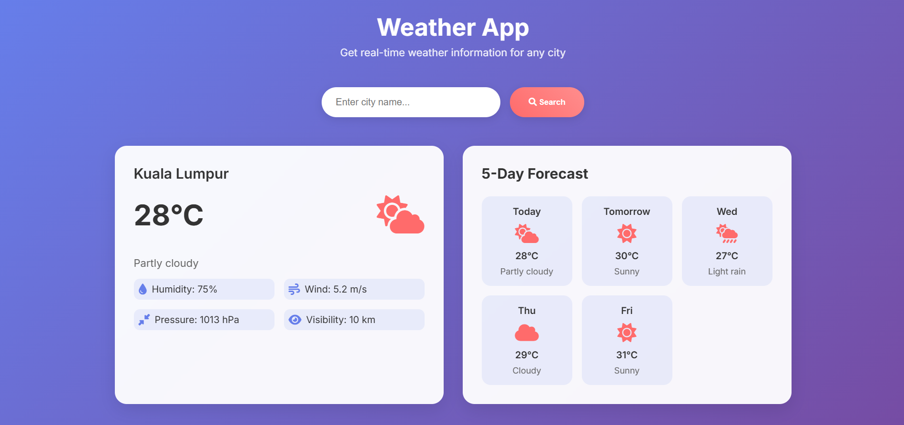

# 🌤️ Weather App

A beautiful, responsive weather application built with React that provides real-time weather information for any city worldwide.

## ✨ Features

- **Real-time Weather Data**: Get current weather conditions for any city
- **5-Day Forecast**: View weather predictions for the upcoming days
- **Responsive Design**: Works perfectly on desktop, tablet, and mobile devices
- **Smart API System**: Automatically handles API key activation and fallback
- **Beautiful UI**: Modern, clean interface with weather icons
- **Detailed Information**: Temperature, humidity, wind speed, pressure, and visibility

## 🚀 Live Demo

[Add your GitHub Pages link here once deployed]

## 📸 Screenshots



## 🛠️ Technologies Used

- **React** - Frontend framework
- **OpenWeatherMap API** - Weather data
- **wttr.in API** - Fallback weather service
- **Font Awesome** - Weather icons
- **CSS3** - Styling and animations

## 📋 Prerequisites

- A modern web browser
- OpenWeatherMap API key (free)

## 🔧 Installation & Setup

### 1. Clone the Repository
```bash
git clone https://github.com/yourusername/weather-app.git
cd weather-app
```

### 2. Get Your API Key
1. Visit [OpenWeatherMap API](https://openweathermap.org/api)
2. Sign up for a free account
3. Get your API key from the dashboard
4. **Note**: New API keys may take 2-4 hours to activate

### 3. Configure the API Key
1. Open `script.js`
2. Replace `'YOUR_API_KEY_HERE'` with your actual API key:
```javascript
const API_KEY = 'your_actual_api_key_here';
```

### 4. Run the Application
1. Open `index.html` in your web browser
2. Or use a local server:
```bash
# Using Python
python -m http.server 8000

# Using Node.js
npx serve .
```

## 🎯 How to Use

1. **Search for a City**: Enter any city name in the search box
2. **View Current Weather**: See temperature, conditions, and details
3. **Check Forecast**: Scroll down to view the 5-day forecast
4. **Explore Details**: View humidity, wind speed, pressure, and visibility

## 🔄 Smart API System

The app uses a smart fallback system:
- **Primary**: OpenWeatherMap API (when API key is active)
- **Fallback**: wttr.in API (free, no API key required)
- **Automatic**: Seamlessly switches between APIs based on availability

## 📱 Responsive Design

The app is fully responsive and works on:
- Desktop computers
- Tablets
- Mobile phones
- All modern browsers

## 🎨 Customization

You can easily customize the app by:
- Modifying colors in `styles.css`
- Adding new weather icons
- Changing the default city
- Adding more weather details

## 🤝 Contributing

1. Fork the repository
2. Create a feature branch (`git checkout -b feature/AmazingFeature`)
3. Commit your changes (`git commit -m 'Add some AmazingFeature'`)
4. Push to the branch (`git push origin feature/AmazingFeature`)
5. Open a Pull Request

## 📄 License

This project is licensed under the MIT License - see the [LICENSE](LICENSE) file for details.

## 🙏 Acknowledgments

- [OpenWeatherMap](https://openweathermap.org/) for weather data
- [wttr.in](https://wttr.in/) for fallback weather service
- [Font Awesome](https://fontawesome.com/) for weather icons
- [React](https://reactjs.org/) for the amazing framework

## 📞 Support

If you encounter any issues:
1. Check that your API key is correctly set
2. Ensure your API key is activated (may take 2-4 hours)
3. Verify you haven't exceeded the free tier limit (1000 calls/day)
4. Open an issue on GitHub

---

**Made with ❤️ by [Your Name]** 